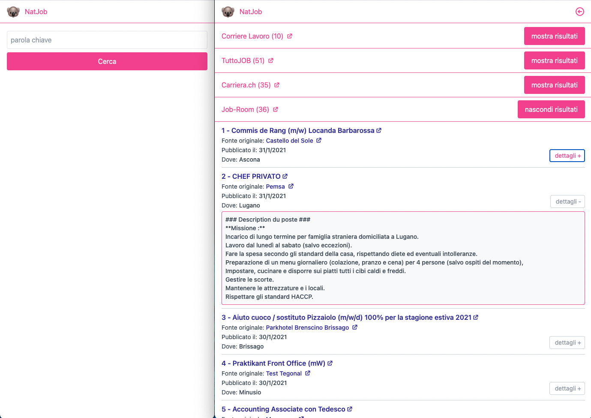

# natjob-webclient

This project borns to help a friend of mine: she was struggling to find a job. So the idea to experiment a little bit with [Puppeteer](https://pptr.dev/), [Vue 3.0](https://v3.vuejs.org/), and [tailwindcss](https://tailwindcss.com/), to have fun, learn something new, and... sure, maybe scrape a bit through portals offering jobs to help her.

It is composed by two parts:
- a [_backend REST API_](https://github.com/arcadeJHS/natjob-api) written in [Nest](https://github.com/nestjs/nest)
- a _frontend client application_ written with [Vue 3.0](https://v3.vuejs.org/) and [tailwindcss](https://tailwindcss.com/) (this repo)

> App demo: http://natjob.matteopiazza.wtf/#/



## Installation

```bash
$ npm install
#or
$ yarn install
```

### Compiles and minifies for production
```
npm run build
```

### Lints and fixes files
```
npm run lint
```

## Configuring the app
Configure the REST API base through the environment variable `VUE_APP_API_BASE`.
You can use a .env file, as in the repo's example, or configure your environment variable as you prefer.

### Compiles and hot-reloads for development
```
npm run serve
```

## License

[MIT licensed](LICENSE).
